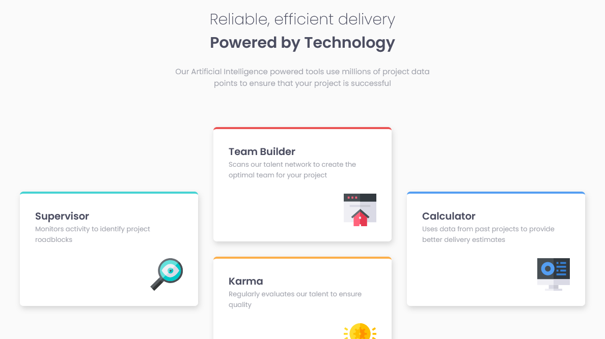

This is my attempt at completing this challenge from frontendmentor.io. The original instructions are below. Feel free to fork this repository!

Live site here: https://jsweeney-four-card-feature-section.netlify.app/

Visit the challenge here: https://www.frontendmentor.io/solutions/fourcardfeaturesection-with-grid-and-funky-hover-evP4_RnLi

## About

I completed this challenge using plain HTML and CSS.  

